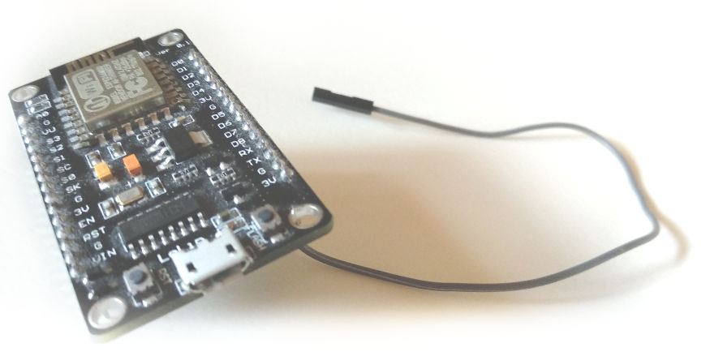
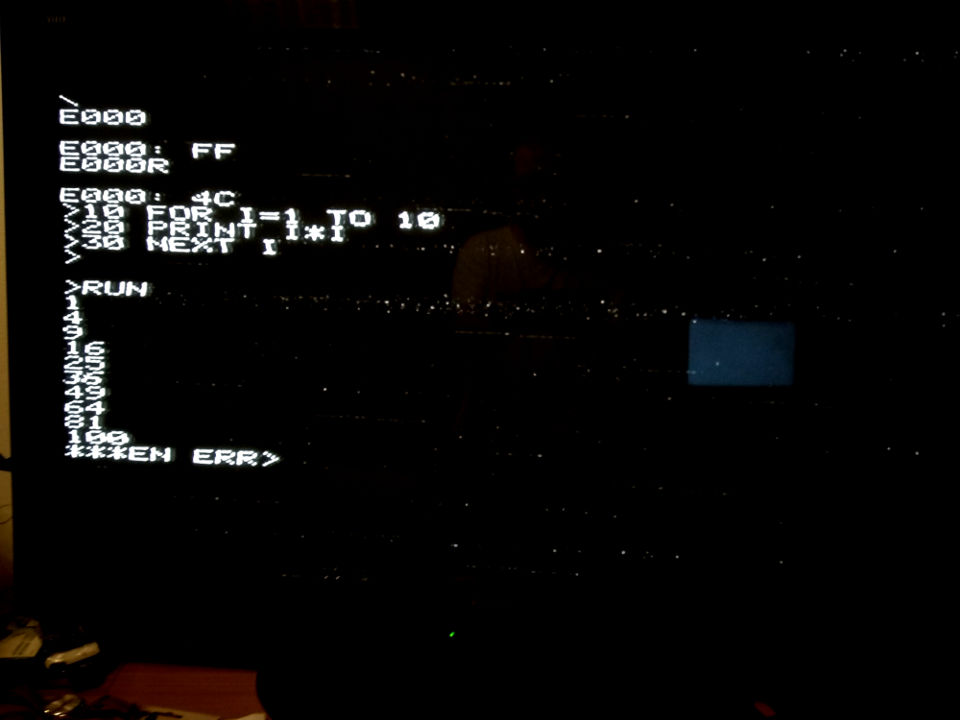
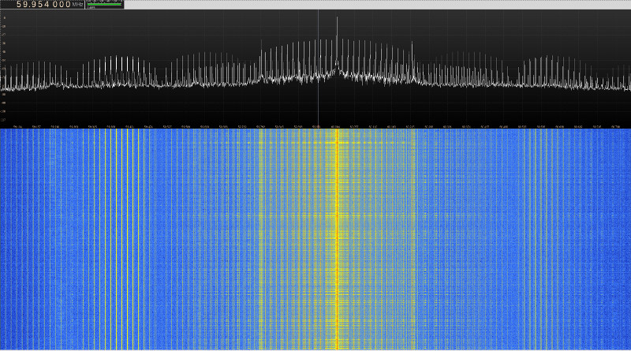

# espple - Apple 1 Emulator with PAL RF Output

Try out the original Apple 1 with a 3$ ESP8266 board on your living room TV - **wirelessly**!



## Features

- MOS 6502 CPU emulated at native speed (1 MHz)
- 20 kB RAM
- PAL TV signal output
- Original Signetics 2513 ROM characters
- Telnet used for keyboard input
- Built-in TFTP server for uploading software
- Everything is wireless



## How does it work?

High frequency modulated video signal is generated internally (via I2S/DMA) and all you need is a single piece of wire to play antenna. Even though it's extremely weak, it can still be picked up on your TV in the same room.

I2S stands for Inter-IC Sound, a standard for digital audio devices interconnect. ESP8266 supports I2S bus data output using DMA transfers, providing a way to generate a steady stream of bits while the processor can do something else. It gets interrupted when the 'bucket' is empty, and it fills it again with more bits to be pumped out.

By generating patterns in those bits, it's possible to produce a meaningful waveform which can be interpreted as a video signal by a TV. Since I live in Europe, the chosen video system is 625 lines CCIR system B (basically PAL B without the color).



---

## Instructions

### Flashing the files

1. Install programmer software.
	* Linux - install [esptool](https://github.com/espressif/esptool) (_apt-get install esptool_ on debian-like systems, _pip install esptool_ or _git clone_ the repo),
	* Windows - use [Flash download tools](http://espressif.com/en/support/download/other-tools)


2. Write the binary files (adjust your port name)

```
esptool -p /dev/ttyUSB0 write_flash --flash_mode dio 0x00000 image.elf-0x00000.bin 0x40000 image.elf-0x40000.bin
```

  Tip - ESP-12E modules require flash_mode dio, most other boards use qio.

3. Provide your wi-fi credentials

```
make credentials ssid="Your SSID" password="Your password"
```

This will generate a .bin file containing the credentials and write it to flash memory at 0x3C000. Please keep this in mind and run this command again with dummy credentials if you intend to sell or borrow your ESP board.

4. Connect a piece of breadboard jumper cable to the RX pin (GPIO 3)

5. Turn your TV on and select analogue TV, PAL system - channel 4. Some manual fine tuning might be required.

6. Telnet to the ESP - the IP address can be read through the cable used to flash the firmware. Make sure your terminal program is set to 115200,8N1. Press enter several times after connecting.


### Loading the software

First you need to tell the built-in TFTP server where to store your program. To keep things simple, this always points to the last memory location examined using the built-in monitor which starts after a reboot (the one with the \ prompt).

For BASIC, the target address was E000 hex.

Simply type E000 and press enter, this will specify the upload target address. Then run the TFTP client on your computer and upload the binary file (adjust your target IP accordingly):

```
atftp -p -l software/basic-0xE000.bin 192.168.1.2
```

After TFTP client finishes, simply run the program from target location by typing the location followed by the letter R. If you just transferred BASIC, you would type E000R and be greeted with the '>' prompt.

### Rebooting

Press **Ctrl + C** when connected through telnet to trigger emulator reboot. Neither wi-fi or telnet connection will be dropped.

## Demo

[](https://www.youtube.com/watch?v=rCqbB1UmW8o)

Click on the image to see a video of Espple running.

## Help

##### Q. Backspace doesn't work - it shows _

A. This is by design, Apple 1 output works more like a teletype, there is no going back so this is the "rub out" symbol which tells the computer to disregard the previous symbol.

##### Q. I've flashed your bin files and now I'm in a reboot loop

A. My board is an ESP-12E, and requires DIO flash mode to be set (2 pins used for address and data) as opposed to QIO mode (4 pins used) some other variants use. Try flashing with DIO and see if that helps.

##### Q. Wifi doesn't connect

A. Make sure you've set the credentials like instructed. Try moving the ESP board closer to the access point and configure it to use one of the lower frequency channels (1-6). You can monitor progress using a serial connection (115200, 8N1).

##### Q. Why can't I simply use the serial as a keyboard input? This wi-fi thing seems overengineered.

A. Because the UART0 RX line is already being used as an I2S output, and UART1 exposes TX pin only to the board.

On the plus side, it's totally wireless.

##### Q. Program doesn't start after TFTP upload

A. A packet was probably lost, try again and make sure you have a good wi-fi reception.

##### Q. I'd like to use NTSC

A. Few people asked about the possibility of generating NTSC signal so I've updated the source to support both. Edit generate\_video.c and change #define PAL to #define NTSC.

##### Q. I can't find a signal on the TV

A. Your RF input connector and the whole signal path is shielded inside the TV so there should be some sort of antenna plugged in. If you don't have an indoor antenna, a piece of wire will do just fine. Make sure you don't short the tip and ring of your input connector because you won't receive anything. In your TV menu choose analogue TV, choose PAL standard and select channel 4. The esp board emits at 60 MHz which is slightly lower than channel 4 frequency, so you might have to fine tune a bit. Most modern TVs should be able to automatically scan and find the channel for you.

## Missing features

The emulator should accomodate for the terminal output delay. It should be possible to upload the original tape audio waveform over tftp and use the original Apple Cassette Interface to read it.

## License

This software is licensed under the MIT license.

## Credits

Video generation is derived from the much more impressive [channel3](https://github.com/cnlohr/channel3) project by [Charles Lohr](https://github.com/cnlohr).

CPU core is made using the fake6502 project by Mike Chambers.

Apple 1 was famously made by [Stephen Wozniak](https://en.wikipedia.org/wiki/Steve_Wozniak), one of the greatest engineers of our time.
